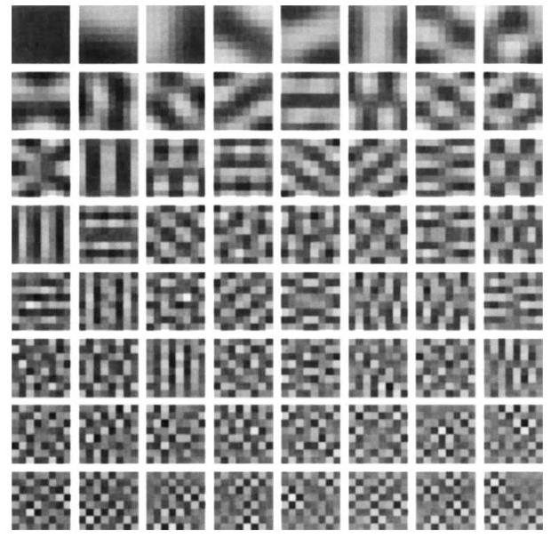

## Emergence of simple-cell receptive field properties by learning a sparse code for natural images

Bruno A. Olshausen* \& David J. Field

Department of Psychology, Uris Hall, Cornell University, Ithaca, New York 14853, USA

The receptive fields of simple cells in mammalian primary visual cortex can be characterized as being spatially localized, oriented ${ }^{1-4}$ and bandpass (selective to structure at different spatial scales), comparable to the basis functions of wavelet transforms ${ }^{5,6}$. One approach to understanding such response properties of visual neurons has been to consider their relationship to the statistical structure of natural images in terms of efficient coding ${ }^{7-12}$. Along these lines, a number of studies have attempted to train unsupervised learning algorithms on natural images in the hope of developing receptive fields with similar properties ${ }^{13-19}$, but none has succeeded in producing a full set that spans the image space and contains all three of the above properties. Here we investigate the proposal ${ }^{9,12}$ that a coding strategy that maximizes sparseness is sufficient to account for these properties. We show that a learning algorithm that attempts to find sparse linear codes for natural scenes will develop a complete family of localized, oriented, bandpass receptive fields, similar to those found in the primary visual cortex. The resulting sparse image code provides a more efficient representation for later stages of processing because it possesses a higher degree of statistical independence among its outputs.

We start with the basic assumption that an image, $I(x, y)$, can be represented in terms of a linear superposition of (not necessarily orthogonal) basis functions, $\phi_{i}(x, y)$ :

$$
I(x, y)=\sum a_{i} \phi_{i}(x, y)
$$

The image code is determined by the choice of basis functions, $\phi_{i}$. The coefficients, $a_{i}$, are dynamic variables that change from one image to the next. The goal of efficient coding is to find a set of $\phi_{i}$ that forms a complete code (that is, spans the image space) and results in the coefficient values being as statistically independent as possible over an ensemble of natural images. The reasons for desiring statistical independence have been elaborated elsewhere ${ }^{9,12,19}$, but can be summarized briefly as providing a strategy for extracting the intrinsic structure in sensory signals.

One line of approach to this problem is based on principalcomponents analysis ${ }^{14,15,20}$, in which the goal is to find a set of mutually orthogonal basis functions that capture the directions of maximum variance in the data and for which the coefficients are pairwise decorrelated, $\left\langle a_{i} a_{j}\right\rangle=\left\langle a_{i}\right\rangle\left\langle a_{j}\right\rangle$. The receptive fields that result from this process are not localized, however, and the vast majority do not at all resemble any known cortical receptive fields (Fig. 1). Principal components analysis is appropriate for capturing the structure of data that are well described by a gaussian cloud, or in which the linear pairwise correlations are the most important form of statistical dependence in the data. But natural scenes contain many higher-order forms of statistical structure, and there is good reason to believe they form an extremely nongaussian distribution that is not at all well captured by orthogonal components ${ }^{12}$. Lines and edges, especially curved and fractal-like edges, cannot be characterized by linear pairwise statistics ${ }^{6,21}$ and so a method is needed for evaluating the representation that can

[^0]

FIG. 1 Principal components calculated on $8 \times 8$ image patches extracted from natural scenes by using Sanger's rule ${ }^{14}$. The full set of 64 components is shown, ordered by their variance (by columns, then by rows). The oriented structure of the first few principal components does not arise as a result of the oriented structures in natural images, but rather because these functions are composed of a small number of low-frequency components (the lowest spatial frequencies account for the greatest part of the variance in natural scenes ${ }^{9}$ ). Reconstructions based solely on the first row of functions will merely yield blurry images. Identical-looking components are obtained for images with the same amplitude spectrum as natural images but with randomized phases (that is, $1 / f$ noise).
take into account higher-order statistical dependences in the data.

The existence of any statistical dependences among a set of variables may be discerned whenever the joint entropy is less than the sum of individual entropies, $H\left(a_{1}, a_{2}, \ldots, a_{n}\right)<\Sigma_{i} H\left(a_{i}\right)$, otherwise the two quantities will equal. Assuming that we have some way of ensuring that information in the image (joint entropy) is preserved, then a possible strategy for reducing statistical dependences is to lower the individual entropies, $H\left(a_{i}\right)$, as much as possible. In Barlow's terms ${ }^{19}$, we seek a minimum-entropy code. We conjecture that natural images have 'sparse structure'-that is, any given image can be represented in terms of a small number of descriptors out of a large set ${ }^{6,12}$ - and so we shall seek a specific form of low-entropy code in which the probability distribution of each coefficient's activity is unimodal and peaked around zero.

The search for a sparse code can be formulated as an optimization problem by constructing the following cost function to be minimized:

$$
E=-[\text { preserve information }]-\lambda[\text { sparseness of } a_{i}]
$$

where $\lambda$ is a positive constant that determines the importance of the second term relative to the first. The first term measures how well the code describes the image, and we choose this to be the mean square of the error between the actual image and the reconstructed image:

$$
[\text { preserve information }]=-\sum_{x y}\left[I(x, y)-\sum_{x} a_{i} \phi_{i}(x, y)\right]^{2}
$$

The second term assesses the sparseness of the code for a given image by assigning a cost depending on how activity is distributed among the coefficients: those representations in which activity is spread over many coefficients should incur a higher cost than those in which only a few coefficients carry the load. The cost function we have constructed to meet this criterion takes the sum

[^0]:    * Present address: Center for Neuroscience, UC Davis, Davis, California 95616, USA.