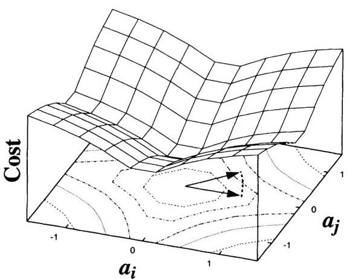
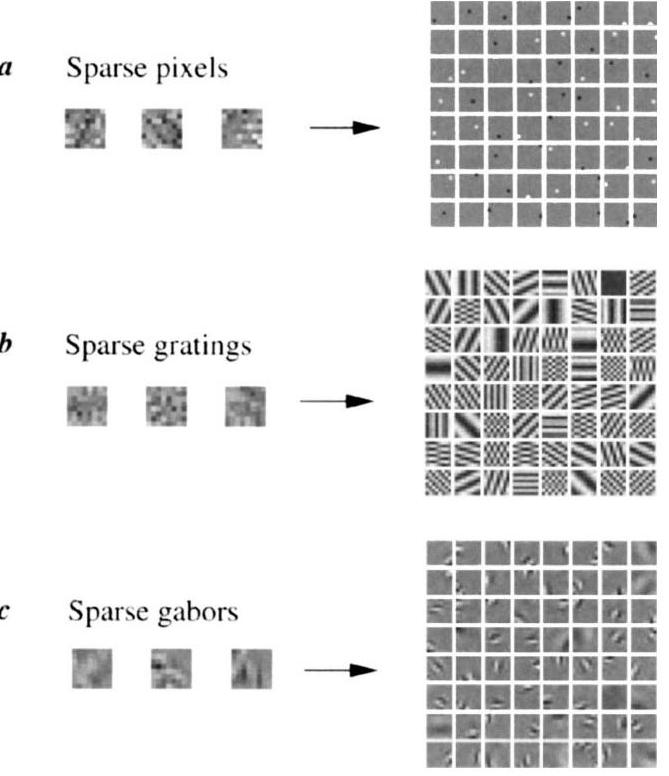

of each coefficient's activity passed through a nonlinear function $S(x)$ :

$$
\left|\text { sparseness of } a_{i}\right|=-\sum_{i} S\left(\frac{a_{i}}{\sigma}\right)
$$

where $\sigma$ is a scaling constant. The choices for $S(x)$ that we have experimented with include $-\mathrm{e}^{-x^{2}}, \log \left(1+x^{2}\right)$ and $|x|$, and all yield qualitatively similar results (described below). The reasoning behind these choices is that they will favour among activity states with equal variance those with the fewest number of non-zero coefficients. This is illustrated in geometric terms in Fig. 2.

Learning is accomplished by minimizing the total cost functional, $E$ (equation (2)). For each image presentation, $E$ is minimized with respect to the $a_{i}$. The $\phi_{i}$ then evolve by gradient descent on $E$ averaged over many image presentations. Thus for a given image, the $a_{i}$ are determined from the equilibrium solution to the differential equation:

$$
\dot{a}_{i}=b_{i}-\sum_{j} C_{i j} a_{j}-\frac{i}{\sigma} S^{\prime}\left(\frac{a_{i}}{\sigma}\right)
$$

where $b_{i}=\Sigma_{x, i} \phi_{i}(x, y) I(x, y)$ and $C_{i j}=\Sigma_{x, i} \phi_{i}(x, y) \phi_{j}(x, y)$. The learning rule for updating the $\phi$ is then:

$$
\Delta \phi_{i}\left(x_{m}, y_{n}\right)=\eta\left\langle a_{i}\right| \hat{I}\left(x_{m}, y_{n}\right)-\hat{I}\left(x_{m}, y_{n}\right)\left\rangle\right.
$$

where $\hat{I}$ is the reconstructed image, $\hat{I}\left(x_{m}, y_{n}\right)=\Sigma_{i} a_{i} \phi_{i}\left(x_{m}, y_{n}\right)$, and $\eta$ is the learning rate. One can see from inspection of equations (5) and (6) that the dynamics of the $a_{i}$, as well as the learning rule for the $\phi_{i}$, have a local network implementation. An intuitive way of understanding the algorithm is that it is seeking a set of $\phi_{i}$ for which the $a_{i}$ can tolerate 'sparsification' with minimum reconstruction error. Importantly, the algorithm allows for the basis functions to be overcomplete (that is, more basis functions than meaningful dimensions in the input) and non-orthogonal ${ }^{3}$, without reducing the degree of sparseness in the representation. This is because the sparseness cost function, $S$, forces the system to choose, in the case of overlaps, which basis functions are most effective for describing a given structure in the image.

The learning rule (equation (6)) was tested on several artificial datasets containing controlled forms of sparse structure, and the

FIG. 2 The cost function for sparseness, plotted as a function of the joint activity of two coefficients, $a_{i}$ and $a_{j}$. In this example, $S(x)=\log \left(1+x^{2}\right)$. An activity vector that points towards a corner, where activity is distributed equally between coefficients, will incur a higher cost than a vector with the same length that lies along one of the axes, where the total activity is loaded onto one coefficient. The gradient tends to 'sparsify' activity by differentially reducing the value of low-activity coefficients more than high-activity coefficients. Alternatively, the sparseness cost function may be interpreted as the negative logarithm of the prior probability of the $a_{i}$ (ref. 23), assuming statistical independence among the $a_{i}$ (that is, a factorial distribution), and with the shape of the distribution specified by $S$ (in this case a Cauchy distribution).
results of these tests (Fig. 3) confirm that the algorithm is indeed capable of discovering sparse structure in input data, even when the sparse components are non-orthogonal. The result of training the system on $16 \times 16$ image patches extracted from natural scenes is shown in Fig. 4a. The vast majority of basis functions are well localized within each array (with the exception of the lowfrequency functions). Moreover, the functions are oriented and selective to different spatial scales. This result should not come as a surprise, because it simply reflects the fact that natural images contain localized, oriented structures with limited phase alignment across spatial frequency ${ }^{6}$. The functions $\phi_{i}$ shown are the feedforward weights that, in addition to other terms, contribute to the value of each $a_{i}$ (refer to term $b_{i}$ in equation (5)). To establish the correspondence to physiologically measured receptive fields, we mapped out the response of each $a_{i}$ to spots at every position: the results of this analysis show that the receptive fields are very similar in form to the basis functions (Fig. 4b). The entire set of basis functions forms a complete image code that spans the joint space of spatial position, orientation and scale (Fig. 4c) in a manner similar to wavelet codes, which have previously been shown to form sparse representations of natural images ${ }^{8,12,22}$. The average spatial-frequency bandwidth is 1.1 octaves (s.d., 0.5 ) with an average aspect ratio (length/width) of 1.3 (s.d., 0.5 ), which are characteristics reasonably similar to those of simple-cell receptive fields $(\sim 1.5$ octaves, length/width $\sim 2)^{3}$. The resulting histograms have sparse distributions (Fig. 4d), decreased entropy

## Training set

a Sparse pixels

FIG. 3 Test cases. Representative training images are shown at the left and the resulting basis functions that were learned from these examples are shown at the right. In $a_{i}$ images were composed of sparse pixels: each pixel was activated independently according to an exponential distribution, $P(x)=\mathrm{e}^{-|x|} / Z$. In $b_{i}$ images were composed similarly to $a_{i}$ except with gratings instead of pixels (that is, 'sparse pixels' in the Fourier domain). In c, images were composed of sparse, non-orthogonal Gabor functions with the method described by Field ${ }^{22}$. In all cases, the basis functions were initialized to random initial conditions. The learned basis functions successfully recover the sparse components from which the images were composed. The form of the sparseness cost function was $S(x)=-\mathrm{e}^{-x^{2}}$, but other choices (see text) yield the same results.