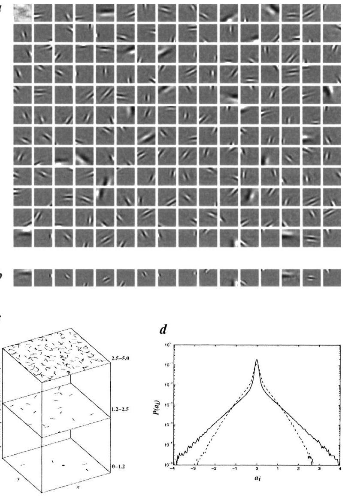

FIG. 4 Results from training a system of 192 basis functions on $16 \times 16$-pixel image patches extracted form natural scenes. The scenes were ten $512 \times 512$ images of natural surroundings in the American northwest, preprocessed by filtering with the zero-phase whitening/lowpass filter $R(T)=\mathrm{fa}^{-1 / 2} c^{2} ; f_{0}=200$ cycles/picture (see also ref. 9). Whitening counteracts the fact that the mean-square error (or m.s.e.) preferentially weights low frequencies for natural scenes, whereas the attenuation at high spatial-frequencies eliminates artefacts of rectangular sampling. The a, were computed by the conjugate gradient method, halting when the change in $E$ was less than $1 \%$. The $\phi$, were initialized to random values and were updated every 100 image presentations. The vector length (gain) of each basis function, $\phi_{i}$, was adapted over time so as to maintain equal variance on each coefficient. A stable solution was arrived at after $\sim 4,000$ updates ( $\sim 400,000$ image presentations). The parameter $\lambda$ was set so that $\lambda / \sigma=0.14$, with $\sigma^{2}$ set to the variance of the images. The form of the sparseness cost function was $S(x)=\log (1+x^{2})$. a, The learned basis functions, scaled in magnitude so that each function fills the grey scale, but with zero always represented by the same grey level (black is negative, white is positive). b, The receptive fields corresponding to the last row of basis functions in a, obtained by mapping with spots (single pixels preprocessed identically with the images). The principal difference may be accounted for by the fact that sparsifying of activity makes units more selective in which aspects of the stimulus they respond to. c, The distribution of the learned basis functions in space, orientation and scale. The functions were subdivided into high-, medium- and low-spatial-frequency bands (in octaves), according to the peak frequency in their power spectra, and their spatial location was plotted within the corresponding plane. Orientation preference is denoted by line orientation. d, Activity histograms averaged over all coefficients for the learned basis functions (solid line) and for random initial conditions (broken line). In both cases, $\lambda / \sigma=0.14$, showing that the learned basis functions can accommodate a higher degree of sparsification. Note that even the random basis functions have positive kurtosis due to sparsification. The width of each bin used in calculating the entropy was 0.04 .
(4.0 bits compared with 4.6 bits before training), and increased kurtosis ( 20 compared with 7.0 ) for a mean-square reconstruction error that is $10 \%$ of the image variance.

These results demonstrate that localized, oriented, bandpass receptive fields emerge when only two global objectives are placed on a linear coding of natural images: that information be preserved, and that the representation be sparse. These two objectives alone are sufficient to account for the principal spatial properties of simple-cell receptive fields. A number of unsupervised learning algorithms based on similar principles have been

[^0]
proposed for finding efficient representations of data ${ }^{25-30}$, all of which seem to have the potential to arrive at results like these. What remains as a challenge for these algorithms, and also for ours, is to provide an account of other response properties of simple cells (for example, direction selectivity), as well as the complex response properties of neurons at later stages of the visual pathway, which are noted for being highly nonlinear. An important question, then, is whether these higher-order properties can be understood by considering the remaining forms of statistical dependence that exist in natural images.

[^1]
[^0]:    Received 10 November 1995; accepted 25 April 1996.

    1. Hubei, D. H. \& Wiesel, T. N. J. Physiol., Lond. 195, 215-244 (1968).
    2. De Velos, R. L., Albrecht, D. G. \& Thorell, L. G. Vision Res. 32, 545-559 (1982).
    3. Jones, J. P. \& Palmer, L. A. J. Neurophysiol. 58, 1233-1258 (1987).
    4. Parker, A. J. \& Hawken, M. J. J. opt. Soc. Am. A8, 598-605 (1988).
    5. Daugnian, J. G. Computational Neuroscience (ed. Schwartz, E.) 403-423 (MIT Press, Cambridge, MA, 1990).
    6. Field, D. J. in Wavelets, Fractals, and Fourier Transforms (eds Farge, M., Hunt, J. \& Vascidicos, C.) 151-193 (Oxford Univ. Press, 1993).
    7. Srinivasan, M. V., Laughlin, S. B. \& Dube, A. Proc. R. Soc. Lond. 8216, 427-459 (1982).
    8. Field, D. J. J. opt. Soc. Am. A4, 2379-2394 (1987).
    9. Rice, J. J. Network 3, 213-251 (1992).
    10. van Halenen, J. H. Nature 360, 68-70 (1992).
    11. Ruderman, D. L. Network 6, 517-548 (1994).
    12. Field, D. J. Neur. Comput. 6, 559-601 (1994).
    13. Barrow, H. G. in IEEE First Int. Conf. on Neural Networks Vol. 4, (eds Caudill, M. \& Butler, C.) 115-121 (Institute of Electrical and Electronics Engineers, 1994).
    14. Sanger, T. D. in Advances in Neural Information Processing Systems Vol. I (ed. Touretzky, D.) 11-19 (Morgan-Aaufmann, 1989).
    15. Hancock, P. J. B., Baddeley, R. J. \& Smith, L. S. Network 3, 61-72 (1992).
    16. Law, C. C. \& Cooper, L. N. Proc. natn. Acad. Sci. U.S.A. 91, 7797-7801 (1994).
    17. Fyfe, C. \& Baddeley, R. Network 6, 333-344 (1995).

[^1]:    18. Schmothuber, J., Eistacher, M. \& Follin, B. Neur. Comput. 8773-786 (1996).
    19. Barlow, H. B. Neur. Comput. 1, 295-311 (1989).
    20. Linsker, R. Computer 105-117 (March, 1988).
    21. Oishausen, B. A. \& Field, D. J. Network 7, 333-339 (1996).
    22. Daugnian, J. G. IEEE Trans. biomed. Engng. 36, 107-114 (1989).
    23. Harpur, G. F. \& Prager, R. W. Network 7, 277-284 (1996).
    24. Foldiak, P. Biol. Cybernet. 64, 165-170 (1990).
    25. Zemei, R. S. thesis, Univ. Toronto (1993).
    26. Intrator, N. Neur. Comput. 4, 58-107 (1992).
    27. Bell, A. J. \& Sejnowski, T. J. Neur. Comput. 7, 1129-1159 (1995).
    28. Saund, E. Neur. Comput. 7, 51-71 (1995).
    29. Hinton, G. E., Dayan, P., Frey, B. J. \& Neal, R. M. Science 268, 1158-1161 (1995).
    30. Lu, Z. L., Chutib, C. \& Sperling, G. Technical Report MBS 96-15 (Institute for Mathematical Behavioral Sciences, University of California at Irvine, 1996).

    ACKNOWLEDGEMENTS. We thank M. Lewicki for helpful discussions at the inception of this work, and C. Lee, C. Brody, G. Harpur, P. Ginoi and M. Riesenhuber for useful input. This work was supported by grants from NIMH to both authors. Part of this work was carried out at the Center for Biological and Computational Learning at the Massachusetts Institute of Technology.

    CORRESPONDENCE and requests for materials to be addressed to B.A.O. (e-mail: bruno@ai.mit.edu). The program for running the simulation, as well as the images used in training, are available via http://redwood.psych.cornell.edu/sparsemet/sparsemet.html.